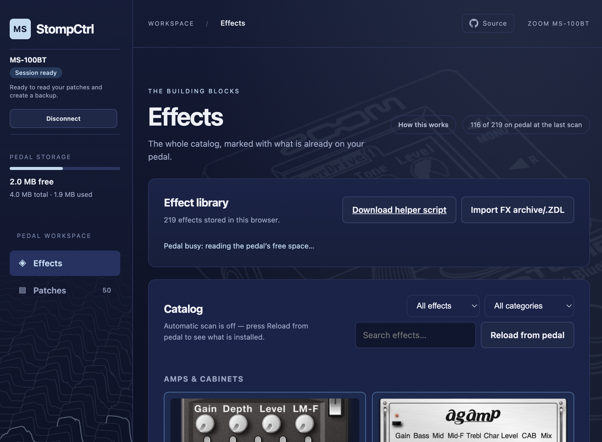
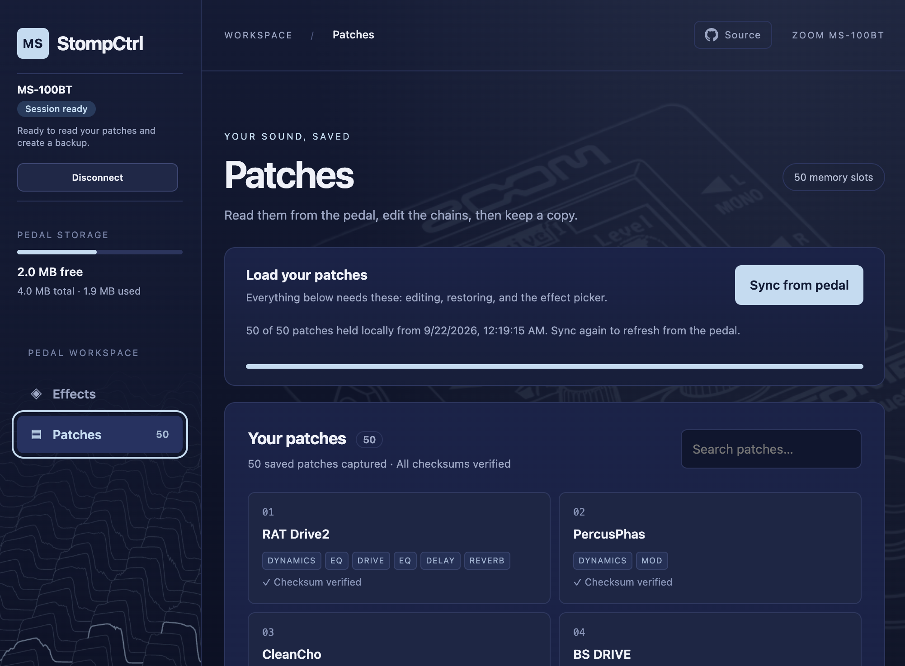
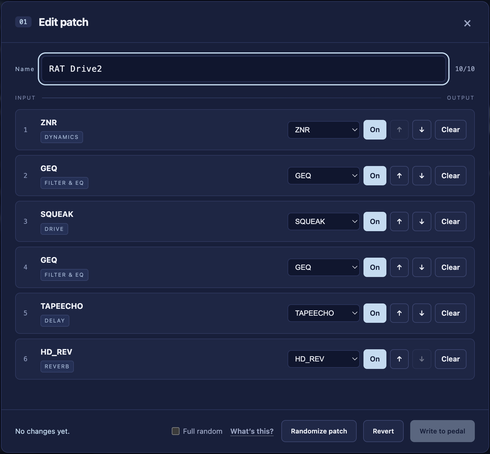

# MS StompCtrl

A browser-only editor and backup tool for the **ZOOM MS-100BT** guitar pedal.

ZOOM's own StompShare app clunky, requires an iPad/iOSand and is no longer
updated. This replaces it with a static web page: no server, no install, no
account. Your pedal talks to Chrome over Bluetooth and nothing leaves your
machine.

> **Work in progress.** This writes to your pedal's flash memory. Back up your
> patches first. The page asks you to accept this once, and remembers your answer
> in browser storage; `riskNotice.reset()` in the console brings it back.
>
> **Unofficial.** Not affiliated with, endorsed by, or supported by ZOOM
> Corporation. See [NOTICE.md](NOTICE.md).

## What it does

- **Read all 50 patches** off the pedal, with checksums verified
- **Edit chains** — rename a patch, reorder effects, bypass them, swap one
  effect for another, clear a slot
- **Write patches back** to the pedal
- **Back up and restore**, as a JSON file or a bundle with the effect binaries
- **Install effects** onto the pedal from `.ZDL` files
- **Browse what's installed**, with the pedal's own file list

The last read is kept in your browser's local storage, so the patch list and
the editor keep working with no pedal attached.





## Custom ZDL
Custom .ZDL can be installed, have a look at:
- https://github.com/repeat98/ZoomMultistompZDL
- https://github.com/themanro/ZoomMultistompZDL
- https://www.reddit.com/r/zoommultistomp/


## Running it
Available here:
https://1njected.github.io/ms-stompctrl/

Chrome is required — it is the only browser that implements Web Serial over
Bluetooth RFCOMM, which is how this talks to the pedal.

Pick the entry whose service UUID is `00000000-deca-fade-deca-deafdecacaff`.
The pedal advertises a second, plain serial port that never answers.

Pairing still happens in your operating system's Bluetooth settings. A hosted
page cannot pair a device for you — it can only open a port you have already
paired and then chosen in Chrome's picker.

Self-host the webbapp:
```sh
./serve.sh              # python3 -m http.server on 127.0.0.1:8765
```

Then open <http://127.0.0.1:8765>, pair the pedal in your OS Bluetooth
settings, and press **Connect pedal**.

### iOS
iOS app available in /iosapp, needs Apple developer account to compile and install.


## Documentation

| | |
|---|---|
| [docs/app.md](docs/app.md) | how the browser client works, and how it was verified |
| [docs/protocol.md](docs/protocol.md) | the ZOOM SysEx protocol: filesystem, patches, effects |
| [docs/bluetooth.md](docs/bluetooth.md) | connection troubleshooting, and what was measured |
| [docs/firmware.md](docs/firmware.md) | notes on the pedal's firmware |
| [docs/iap-audit.md](docs/iap-audit.md) | iAP1 conformance audit of the transport |
| [docs/frida-setup.md](docs/frida-setup.md) | how the original iOS app was instrumented to read the protocol |

`tools/` holds everything else: `macos-bt-diagnose.sh` and `macos-bt-probe/`
diagnose Bluetooth on macOS, `frida/` is the instrumentation used to read the
protocol off the original iOS app, and the `protocol-*.json*` files are the
capture that evidence rests on.

`app/download-effects.py` builds an FX archive from ZOOM's public archive.
`tools/build-effect-names.py` rebuilds `app/effect-names.json` by reading the
effect id at `.ZDL` offset `0x40`. Point it at an FX archive from
`download-effects.py` and it reproduces the catalog-derived names with nothing
else needed — it reads that archive's own `index.json` for display names. The
factory names come from ZOOM's StompShare bundle, which is not distributed here,
so those cannot be rebuilt from a fresh clone.

That index is why the editor can show `SQUEAK` rather than `03000060`. The
pedal cannot supply these names — its file list covers installed effects only,
and 65 of the 68 effects the factory patches use are built into the firmware
with no file to enumerate.

Each of these is a reference rather than a log: what was established and how it
was verified, without the order it was found in.

## Troubleshooting
If connection get stuck or wont connect at all, you may have to restart the pedal and remove the Bluetooth connection from system settings and pair again. Also restart browser before trying again.
On macos there sometimes seem like system services hijack the device because it is announced as "headset".

## Status

Reading, editing, writing and backup are all exercised against real hardware.
Restore is implemented and tested less. The connection itself is the least
reliable part — see [docs/bluetooth.md](docs/bluetooth.md) before concluding
anything is broken.

Writing patches needs **AUTO SAVE** switched on in the pedal's system menu.

## References
Projects that have been a huge help developing this tool:
- https://github.com/oandrew/ipod
- https://github.com/skratchdot/ble-midi
- https://github.com/thammer/zoom-explorer
- https://github.com/g200kg/zoom-ms-utility
- https://github.com/themanro/ZoomMultistompZDL
- https://github.com/repeat98/ZoomMultistompZDL

## Licence

[MIT](LICENSE) for the code in this repository.
